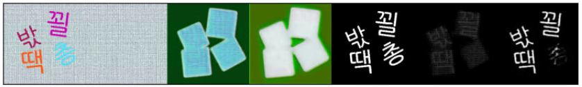
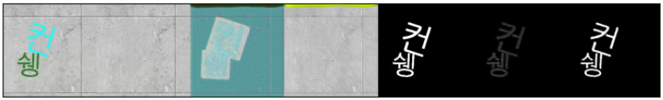
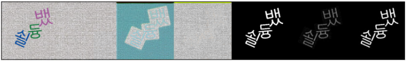
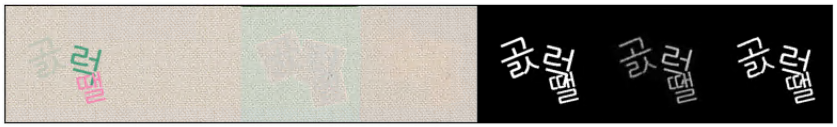
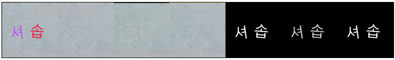

# Scene Text Remover Pytorch Implementation

This is a minimal implementation of [Scene text removal via cascaded text stroke detection and erasing](https://arxiv.org/pdf/2011.09768.pdf). This   github repository is for studying on image in-painting for scene text erasing. Thank you :)


## Requirements

Python 3.7 or later with all [requirements.txt](./requirements.txt) dependencies installed, including `torch>=1.6`. To install run:

```
$ pip install -r requirements.txt
```


## Model Summary


 This model has u-net sub modules. 
`Gd` detects text stroke image `Ms` with `I` and `M`. `G'd` detects more precise text stroke `M's`.
Similarly,  `Gr` generates text erased image `Ite`, and `G'r` generates more precise output `I'te`.


## Custom Dictionary

Not to be confused, I renamed the names.

`I` : Input Image (with text)<br>
`Mm` : Text area mask (`M` in the model)<br>
`Ms` : Text stroke mask; output of `Gd`<br>
`Ms_` : Text stroke mask; output of `G'd`<br>
`Msgt` : Text stroke mask ; ground truth<br>
`Ite` : Text erased image; output of `Gr`<br>
`Ite_` : Text erased image; output of `G'r`<br>
`Itegt`: Text erased image; ground truth<br>


## Prepare Dataset

You need to prepare background images in `backs` directory and text binary images in `font_mask` directory. 


[part of background image sample, text binary image sample]

Executing `python create_dataset.py` will automatically generate `I`, `Itegt`, `Mm`, `Msgt` data.
(If you already have `I`, `Itegt`, `Mm`, `Msgt`, you can skip this section)

```
├─dataset
│  ├─backs
│  │  # background images
│  └─font_mask
│  │  # text binary images
│  └─train
│  │  └─I
│  │  └─Itegt
│  │  └─Mm
│  │  └─Msgt  
│  └─val
│     └─I
│     └─Itegt
│     └─Mm
│     └─Msgt
```

I generated my dataset with 709 background images and 2410 font mask.
I used 17040 pairs for training and 4260 pairs for validation.


Thanks for helping me gathering background images [sina-Kim]([sina-Kim (github.com)](https://github.com/sina-Kim)).


## Train

All you need to do is:

``` python
python train.py
```


## Result

From the left
`I`, `Itegt`, `Ite`, `Ite_`, `Msgt`, `Ms`, `Ms_`

* Epoch 2<br>
  
* Epoch 5<br>
  
* Epoch 10<br>
  
* Epoch 30<br>
  
* Epoch 50<br>
  
* Epoch 120<br>
  

These are not good enough for real task. I think the reason is lack of dataset and simplicity. 
But, it was a good experience for me to implement the paper.


## Issue

If you are having a trouble to run this code, please use issue tab. Thank you.

